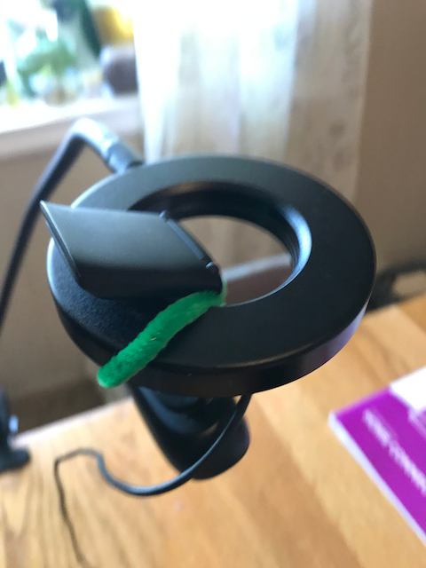
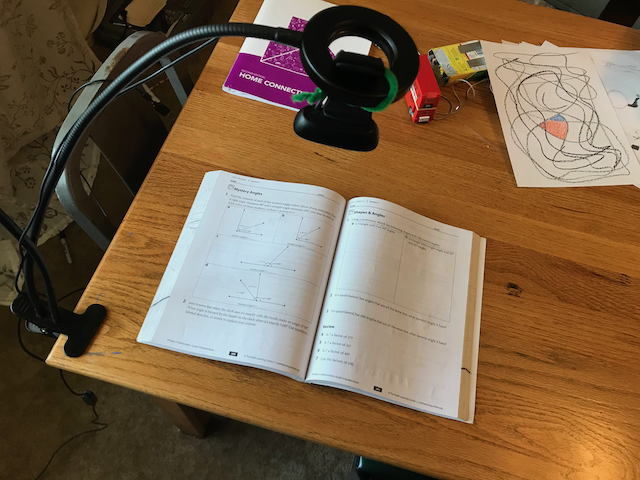
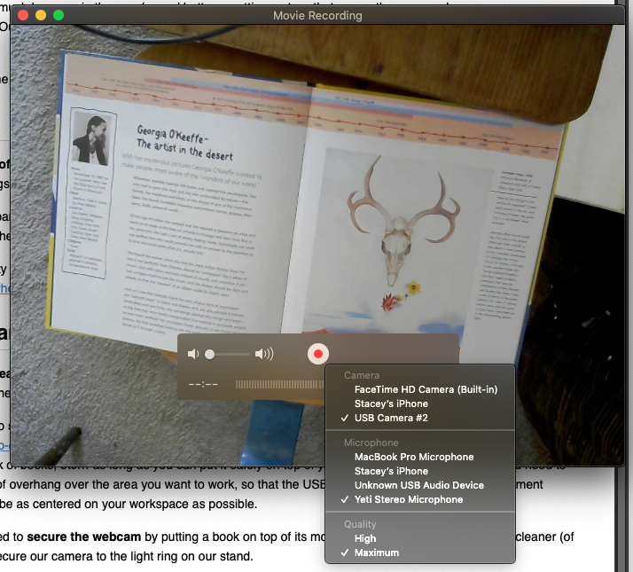
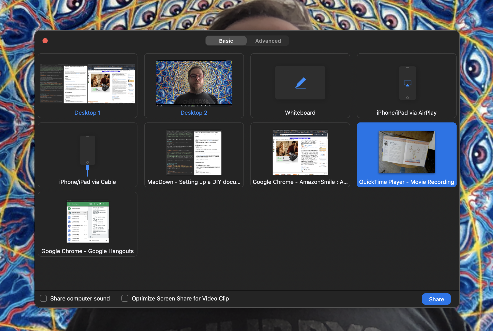

# Setting up a DIY document camera on Zoom for Mac

My wife is an elementary school art teacher, and she needed a way to present a short activity for her students, through Zoom. I helped her with this setup, and her colleagues thought it was useful, so I've written it up for them. If you find it useful, that's great, too. 

With just a few items you probably already have, you can rig up a document cam, for shooting overhead activities (reading a children's book, cooking a recipe, painting a watercolor, etc...). 

This is for Mac, that's what I use. I think you can probably do the same thing on Windows, though Quicktime is not supported on new Windows operating systems, there is probably some other software you can use. 

## Hardware:  

Macbook - Should work on any Mac able to run Zoom

Preferred: **A USB Webcam** - This is the easiest, since you don't have to worry about the iOS camera changing orientation, and there will be much less app in the way (record buttons, settings, etc... that are on the screen when you use your iPhone camera). Ours is an old Logitech that we've had, forever. [Here is an example](https://smile.amazon.com/dp/B0823DXX8W/ref=sspa_dk_detail_0?psc=1&pd_rd_i=B0823DXX8W&pd_rd_w=20uKB&pf_rd_p=48d372c1-f7e1-4b8b-9d02-4bd86f5158c5&pd_rd_wg=tD0AE&pf_rd_r=A81H4MYJ9PTCF44M4C5H&pd_rd_r=067d2811-735c-4855-8f56-c8af179d7c05&spLa=ZW5jcnlwdGVkUXVhbGlmaWVyPUEyWEY4UDNBTlJPRkkmZW5jcnlwdGVkSWQ9QTA0NDYzNjgxMFRMOFFTVVNTWkQ1JmVuY3J5cHRlZEFkSWQ9QTA5OTQyMDg5RUYzMFpDWFhJQVkmd2lkZ2V0TmFtZT1zcF9kZXRhaWwmYWN0aW9uPWNsaWNrUmVkaXJlY3QmZG9Ob3RMb2dDbGljaz10cnVl), anything HD and USB, should probably work.

Runner-up: iPhone or iPad and a Lightning USB cable to connect your iPhone or iPad to your Macbook. When your camera is turned on on your phone, you can use the same steps, below. Be sure to disable time-out, so your screen doesn't go black 10 minutes in. You might also have to play with auto-orientation settings until things work the way you want.

## Software:

**Zoom Meeting software** - Ask your admin to make sure you can host meetings and advise you on secure settings for Zoom Meetings and Webinars for teaching.  

**Suggested Meeting settings** (set when you schedule the meeting):  

* Mute participants upon entry  
* Decide whether you want to enable a waiting room
* Only authenticated users can join

Stanford University has an excellent set of guidelines for securing Zoom meeting and webinars for teaching:
https://teachanywhere.stanford.edu/zoom-course-support

## Step 1: Hardware Setup

1. **Clear the area where you will work**. You might want to put down a whiteboard, or the materials you plan to use to help adjust the height and aim the camera.

2. Find a way to **support the Webcam about 18-24 inches above the table and centered on your workspace**. We used a [clamp-on webcam stand with a ring light](https://smile.amazon.com/dp/B084YTPZY2/ref=sspa_dk_detail_2?psc=1&pd_rd_i=B084YTPZY2&pd_rd_w=jaMax&pf_rd_p=48d372c1-f7e1-4b8b-9d02-4bd86f5158c5&pd_rd_wg=ZbYRT&pf_rd_r=F3BADT71DZ12AYYEXCXY&pd_rd_r=513a7032-66f8-40dd-9ca5-aabaf627386c&spLa=ZW5jcnlwdGVkUXVhbGlmaWVyPUEzNEc1WFdHQjVTVVAmZW5jcnlwdGVkSWQ9QTAwOTkyNjBHQVhNUFpGRFFFQlYmZW5jcnlwdGVkQWRJZD1BMTA0NTIyMDFCMjJGVjBWQlhTVk8md2lkZ2V0TmFtZT1zcF9kZXRhaWwmYWN0aW9uPWNsaWNrUmVkaXJlY3QmZG9Ob3RMb2dDbGljaz10cnVl). You could use a tripod, folding desk lamp, small side table, a light chair, a stack of books, etc... as long as you can put it safely on top of your table.  The main thing is that you need to create a bit of overhang  over the area you want to work, so that the USB Webcam you are using as a document camera can be as centered on your workspace as possible. 

3. You may need to **secure the webcam** by putting a book on top of its mount, etc... we used a colored pipe cleaner (of course) to secure our camera to the light ring on our stand. 

4. **Plug** the **USB camera** into your **Mac**

  
  

## Step 2: Software Setup

### Quicktime Player
1. Open **Quicktime Player** and go to **File>New Movie Recording...**
2. In the resulting window, **click on the small arrow** next to the Record button, and select the **USB Camera** (*it might be called something else, but it will be whatever is* **NOT the built-in Facetime camera**)
3. You should now see whatever your **USB Camera** is pointed at. **Adjust the aim and height**, as needed, until you are happy with the results.
4. **It is not necessary to start recording for this to work!**

### Zoom

1. **Start your Zoom** Meeting
2. At the bottom of your Zoom Window, **click on the Share Screen** button
3. **Select** the **Quicktime Player - Movie Recording** Icon (which should preview your USB Webcam view), and click **Share**.
4. Your viewers will now see the **Quicktime Window, only**. This is handy so you don't have to worry about clearing desktop icons, etc... for your ScreenShare.

Have Fun!

Some links to more good materials:
The [Science Sketches Video How-To Guide](http://docs.wixstatic.com/ugd/16c366_d9d1877771004a80afcd659e14fe798f.pdf), from https://www.sciencesketches.org/  has great tips on setting up a DIY document cam, as well as tips on editing videos, etc...

If you want to get crazy with transitions, title slides, multiple cams, etc..., check out:

1. OBS Studio: https://obsproject.com/
2. This dude is kinda goofy, but this is a [great intro to OBS and greenscreen](https://www.youtube.com/watch?v=VS4OadmJcxg). 
3. Way less goofy guy, but might be beyond some people's comfort zone, technically. If not, [here's how to use OBS Studio with Zoom](https://www.youtube.com/watch?v=9qA82AiRp8s), or any other cam-based platform. 

